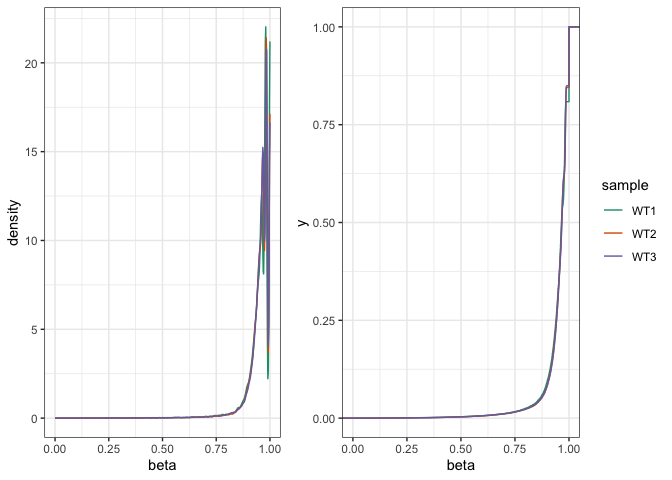
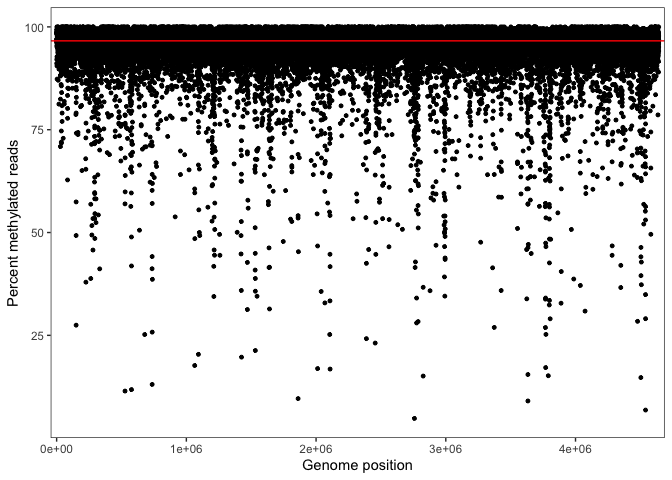
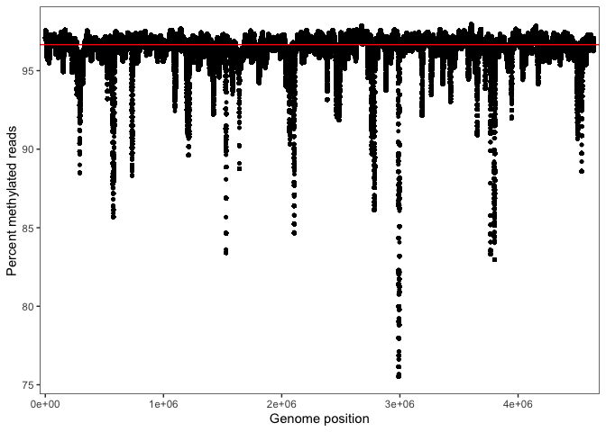
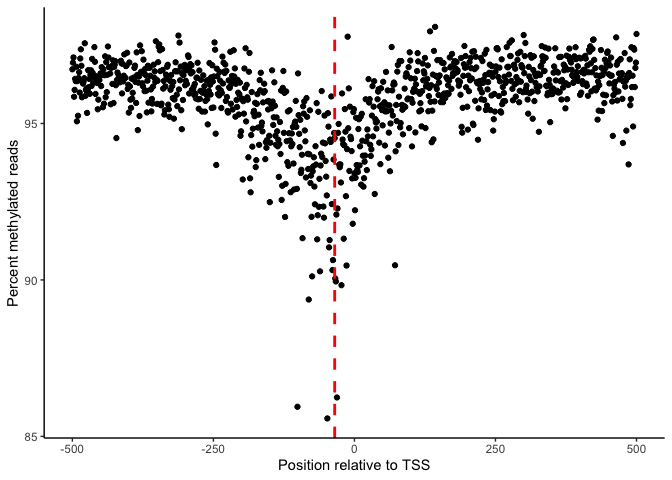

<!-- README.md is generated from README.Rmd. Please edit that file -->

# CoMMA

<!-- badges: start -->
<!-- badges: end -->

CoMMA is designed to take bacterial methylation calls from nanopore
sequencing data then characterize methylation throughout the genome,
identify differentially methylated sites between samples, and compare
full adenine methylomes between samples.

## Installation

You can install the development version of CoMMA from
[GitHub](https://github.com/) with:

``` r
# install.packages("devtools")
devtools::install_github("carl-stone/CoMMA")
```

## Examples from Stone et al. 2022 preprint

``` r
library(CoMMA)
library(tidyverse)
#> ── Attaching packages ─────────────────────────────────────── tidyverse 1.3.2 ──
#> ✔ ggplot2 3.4.0      ✔ purrr   0.3.5 
#> ✔ tibble  3.1.8      ✔ dplyr   1.0.10
#> ✔ tidyr   1.2.1      ✔ stringr 1.5.0 
#> ✔ readr   2.1.3      ✔ forcats 0.5.2 
#> ── Conflicts ────────────────────────────────────────── tidyverse_conflicts() ──
#> ✖ dplyr::filter() masks stats::filter()
#> ✖ dplyr::lag()    masks stats::lag()
library(cowplot)
## basic example code
```

### WT methylome characterization

After calling methylation using Megalodon, we have averaged the percent
methylation (beta) values at each site across all three sequencing
replicates of our laboratory strain *E. coli* K-12 substr. MG1655.

GATC sites are highly methylated in *E. coli*, so the distribution of
beta values is extremely left-skewed.

``` r
WT_dist <- all_samples_long %>% 
  filter(sample == 'WT1' |
           sample == 'WT2' |
           sample == 'WT3') %>% 
  ggplot(aes(x = beta,
             color = sample)) +
  geom_density() +
  theme_bw() +
  theme(legend.position = 'none') + 
  scale_color_brewer(palette = 'Dark2')
WT_ecdf <- all_samples_long %>% 
  filter(sample == 'WT1' |
           sample == 'WT2' |
           sample == 'WT3') %>% 
  ggplot(aes(x = beta,
             color = sample)) +
  stat_ecdf() +
  theme_bw() +
  scale_color_brewer(palette = 'Dark2')
WT_distributions <- plot_grid(WT_dist, WT_ecdf,
                              rel_widths = c(0.75, 1))
WT_distributions
```



This saturation holds across the genome, though there are a few
significant dips. The genome-wide median (red line) beta value is 96.6%.

``` r
beta_x_position <- WT_average %>%
  group_by(Position) %>% 
  ggplot(aes(x = Position, y = beta*100)) + 
  geom_point(size = 1) +
  theme_bw() +
  scale_x_continuous(expand = expansion(mult = c(0.01, 0.01))) +
  geom_hline(yintercept = median(WT_average$beta*100),
             color = "red") +
  labs(x = "Genome position",
       y = "Percent methylated reads")

beta_x_position
```



A sliding window can smooth out noise and let us see large-scale trends.
However, as the differential methylation analysis will later reveal (and
as well documented in literature), many of these lone, undermethylated
sites are significant. Warning: this takes about 13 minutes on my M1
Mac.

``` r
sliding_window_methylation <- methylRollingMedian(WT_average,
                                                  position_col = 'Position',
                                                  methyl_col = 'beta',
                                                  w_size = 10000,
                                                  method = "exact")

sliding_window_methylation %>% 
  ggplot(aes(x = position, y = med_methyl*100)) + 
  geom_point(size = 1) +
  theme_bw() +
  scale_x_continuous(expand = expansion(mult = c(0.01, 0.01))) +
  geom_hline(yintercept = median(sliding_window_methylation$med_methyl*100,
                                 na.rm = T),
             color = "red") +
  labs(x = "Genome position",
       y = "Percent methylated reads")
```



Now let’s look for some methylation trends within different genomic
features. CoMMA can find average methylation in proximity to
transcription start sites. From this, we see that in our WT sample there
is a dip in methylation centered around TSS’s.

Interestingly, this decrease is centered around the -35 element but
extends \~150 bp on either side.

``` r
WT_all_TSS <- annotateTSS(WT_average, 
                          genome_sites, 
                          location = 'Position', 
                          size = 500)

WT_all_TSS %>% 
  ggplot(aes(x = RelPos, y = beta*100)) +
  stat_summary(geom = 'point',
               fun = median) +
#  geom_quantile(quantiles = 0.5,
#                method = 'rqss',
#                lambda = 1000,
#                size = 1) +
  geom_vline(xintercept = -35, linetype = 'dashed', color = 'red', linewidth = 1) +
  theme_classic() +
  labs(x = 'Position relative to TSS',
       y = "Percent methylated reads")
```



So what could be driving this methylation decrease?

CoMMA makes it easy to annotate GATC sites with genomic features of
interest. In its current state it comes packaged with annotations for
MG1655 built from [EcoCyc](ecocyc.org) with -10 and -35 sites from
[RegulonDB v 10.5](https://regulondb.ccg.unam.mx). In the next release,
it will be able to take a BED file as input for whatever annotations you
want in your favorite organism.

``` r
WT_average_annotated <- annotateMethylSites(methyl_df = WT_average,
                                             meta_df = genome_sites,
                                             location = 'Position')
WT_average_annotated_long <-  WT_average_annotated %>% 
  dplyr::select(!'Transcription-Units') %>% 
  pivot_longer(cols = Genes:'Origin-of-Replication',
               names_to = 'feature_type',
               values_to = 'feature_name') %>% 
  drop_na()
```
